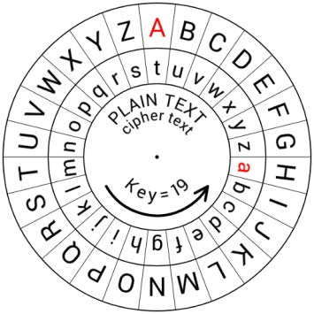

# Caesar Cypher in Python 
<br>             

<div align="center">
 
</div>

<br>

This article will explain how I solved one of the earliest, simplest, and most famous cyphers in history - the Caesar cypher. A Caesar cypher is an encryption technique that takes a message and substitutes each letter of the message with a different letter, a set number of positions down the alphabet. For example, with a shift or offset of 3, "A" is replaced with "D", "B" becomes "E", "C" becomes "F", and so on. When the end of the alphabet is reached, the position of the letters cycles around to the front of the alphabet. In other words, with an offset of 3, "X" then becomes "A", "Y" becomes "B", "Z" becomes "C", and such. 

<br>

A bulk of the code is simply iterating through each letter and replacing it with the corresponding letter-shift. However, some of the challenges involved:   
- accepting capitalized letters
- wrapping back to the front of the alphabet once the end is reached
- and cyphering in either directions
  
I will share how I handled each challenge below. So without furuther ado, let's dive into the code!

<br>

### Step 1: Define function with parameters
<br>

```

def caesar_cypher(message, offset, action):
    if debug: print(f"caesar_cypher() with offset - {offset}")

    message = message.strip()

    if debug: print(f"message = '{message}'")

    if action == "decode":
        offset = -(offset)

    lower_letters = "abcdefghijklmnopqrstuvwxyz"
    upper_letters = "ABCDEFGHIJKLMNOPQRSTUVWXYZ"

```
<br>

Right from the start I decided to handle cypher directions by passing in a separate parameter - action. Upon calling the function, if action was set to "encode", then the cypher would move in the positive direction. If action was set to "decode", then the cypher would work backwards, respectively, by setting the offset value to a negative integer. I also defined two variables containing the alphabet, that I will be indexing into later on in the code. 

<br>

### Step 2: Iterate through each letter
<br>

```

    new_message = []

    for letter in message:

        if trace: print(f"iterating through '{letter}' in message")

        if not letter.isalpha():
            new_message.append(letter)

        else:
            if letter in lower_letters:
                old_index = ord(letter) - ord("a")

            else:
                old_index = ord(letter) - ord("A")

            if trace: print(f"old_index = {old_index}")

```
<br>

Next, I created an empty list (because lists are easier to manipulate than strings) to store the new letter replacements. Now the question to answer is, whether or not the letter in the message is in the alphabet. If it is a special character, say a punctuation, then I will not manipulate it and simply add it, as is, to the empty list. If it is indeed in the alphabet, then I need to know whether or not the letter in question is capitalized. I elected to use Python's built-in ord() function instead of the index() function for efficiency sake. The index() function essentially iterates through a string and returns the index at the first occurence of the specified value. Whereas the ord() function instantly returns the unicode integer of the specified character. Because the value of a lower case letter is different from the value of its upper case counterpart, I had to write a conditional statement based on casing in order to obtain the correct index. 

<br>

### Step 3: Calculate new index 
<br>

```

            new_index = old_index + (offset % 26)

            if new_index > 25:
                new_index -= 26

            if new_index < 0:
                new_index += 26

            if trace: print(f"new_index = {new_index}")

```
<br>

At this point in the process, all I had to do was apply the offset value to the original letter's index to obtain the new index value. To accommodate offset values greater than the length of the alphabet, I set the offset to equal a factor of 26. Then, in order to cycle the letter shift back to the appropriate end of the alphabet (and avoid an IndexError), I wrote a conditional statement handle such such occurrences. 

<br>

### Step 4: Append replacement letter to list 
<br>

```

            if letter.isupper():
                new_message.append(upper_letters[new_index])

            else:
                new_message.append(lower_letters[new_index])

    new_message = "".join(new_message)

    if debug: print(f"new_message = '{new_message}'")

    return new_message

```
<br> 

After obtaining the new index, it was simply a matter of indexing in the appropriate string (upper or lower case letters) to find the new replacement letter. I used the join() method to combine all the letters into one string, and voila! I end up with a new message, with all its letters shifted by the offset value. 

<br>

So there you have it, folks - a simple Caesar cypher written in Python! In my next article, I will review my Vigenere cypher code, which is based off the Caesar method, but has a couple extra layers of complexity to it. The entirety of my Caesar cypher code is available on [GitHub](https://github.com/kimiekomi/code_crack). Thanks for reading and as always, Happy Coding!

<br>