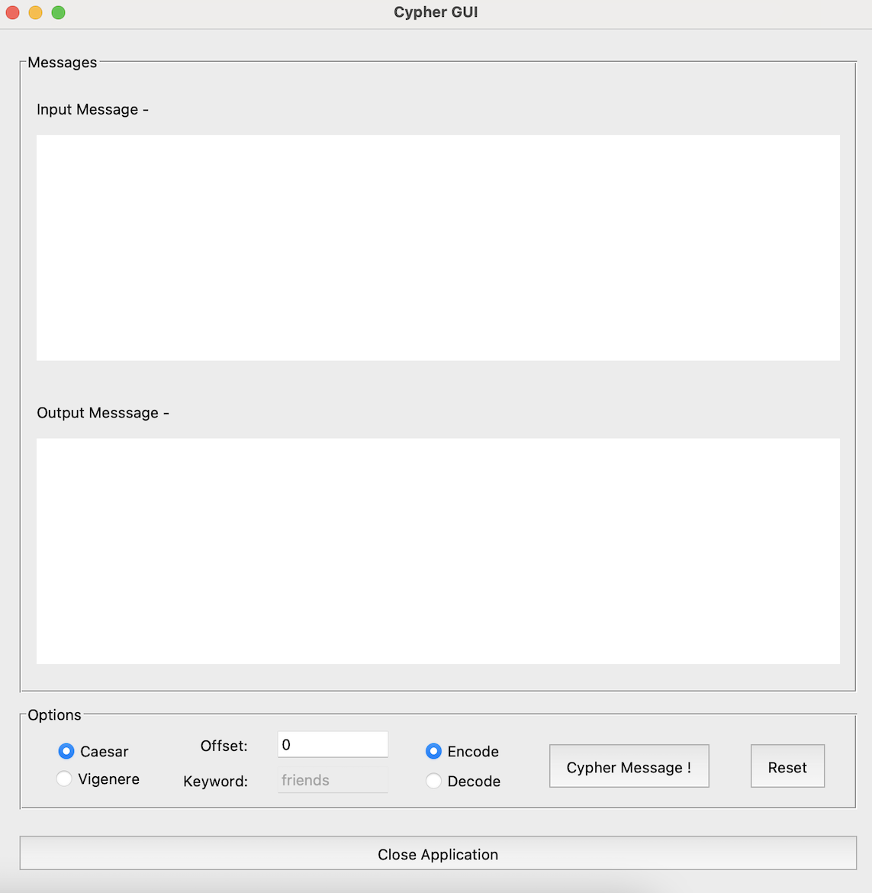

# Python GUI App with Tkinter  
<br>             

<div align="center">
 
</div>

<br>             

This article will explain how I built a Python graphical user interface (GUI) application, and provide a general overview of Tkinter - Python’s standard GUI package. The purpose of my application is to encrypt/decrypt messages using either the Caesar or Vigenere cypher method. Users may enter a plain-text message and select an encryption type to receive a coded message; alternatively, users can enter a scrambled message to convert their message to vanilla text. Please note that, this application only works with the English language, but can accommodate special characters and letter casing.  

So with that, let’s dive into the code! 

<br>             

### GUI window               
<br>             

```python

class App(Tk):
    def __init__(self, title, width, height):
        super().__init__()

        self.title(title)

        # Center app in screen
        self.window_width = width
        self.window_height = height
        self.screen_width = self.winfo_screenwidth()
        self.screen_height = self.winfo_screenheight()
        self.x_coordinate = int((self.screen_width/2) - (self.window_height/2))
        self.y_coordinate = int((self.screen_height/2) - (self.window_width/2))

        # Open app in previos position
        try:
            with open("app.config", "r") as config:
                self.geometry(config.readline())
        
        except:
            self.geometry(f"{self.window_width}x{self.window_height}+{self.x_coordinate}+{self.y_coordinate}")

        self.bind("<Configure>", self.save_position)

    def save_position(self, event):
        with open("app.config", "w") as config:
            config.write(self.geometry())
```    
<br>    

The first task is simply to create a window to contain all the GUI elements. This section is in its own class because it is not integral to the main purpose of the application, and can be reused in future Tkinter projects. I elected to center the window on the screen once the application runs, to avoid repeatedly dragging the window from the upper left corner of the screen each time. Additionally, I provided users the ability to set the position of the window, such that if the user reopens the program, it will appear at the coordinates where the user previously positioned it. This is achieved by creating a function that generates a file and records the position of the window. When the application runs, the program will open the file and set the position to the coordinates in said file.  

<br>             

### Tkinter elements      
<br>             

```python

class CypherApplication(App):
    def __init__(self, title, width, height):
        super().__init__(title, width, height)

        # Messages: Labels, Entries, and Buttons
        self.message = LabelFrame(self, text="Messages")
        self.message.grid(row=0, column=0, padx=20, pady=(20,10))
        ...

        # Options: Labels, Entries, and Buttons
        self.options = LabelFrame(self, text="Options")
        self.options.grid(row=1, column=0, padx=20, pady=(0,10), ipadx=4)
        ...

    # Button functions
    def reset_fields(self):
        ...

    def disable_keyword(self):
        ...

    def disable_offset(self):
        ...
    
    def remove_error(self):
        ...
```

<br>             

The workflow for this application goes from top to bottom then left to right, so that determined the order in which the widgets were positioned. The next step involved creating and adding functionality to various buttons. Users are able to select the method and direction in which to cypher their message. To avoid confusion, I disabled an entry field depending on which cypher method was selected.  In other words, if the “Caesar” button was selected, then the keyword entry would be disabled (and vice-a-versa). This was done because the keyword entry only accepts alphabet characters and the offset entry only accepts integers.          

With regards to user input errors, I created error message labels which will always be hidden unless the user enters “incorrect” data. I also included default settings and values in the application, to expedite the process and enhance the user experience. Whenever the “reset” button is clicked, the program will revert to the default button selections with blank message boxes and hidden error labels.   
              
<br>              

### Caesar and Vigenere functions   
<br>             
      
A bulk of the code is dedicated to defining the Caesar and Vigenere functions. For the sake of brevity, I will not go into the minute details of these functions in this article. A comprehensive description of these functions will be included in the subsequent article. Please note that both of these cypher functions are excluded from the CypherApplication class, to provide individual testing and easy accessibility to the code.   

<br>             

### Main function   
<br>             
      
```python

    def cypher_message(self, options):
        if debug: print("cypher_message()")

        if options == "caesar":
            if trace: print("calling caesar_cypher()")

            message = self.input_box.get("1.0", END).strip()
            action = self.encode_decode.get()

            try:
                offset = int(self.offset_entry.get())

            except:
                self.offset_error_label.grid(row=3, column=0, padx=20, sticky=W)
                return

            if trace: print("message - '{message}', offset = {offset}, action = '{action}'")

            results = caesar_cypher(message, offset, action)

        else:
        if trace: print("calling vigenere_cypher()")

        message = self.input_box.get("1.0", END).strip()
        action = self.encode_decode.get()
        keyword = self.keyword_entry.get()

        if not keyword.isalpha():
            self.keyword_error_label.grid(row=3, column=0, padx=20, sticky=W)
            return

        results = vigenere_cypher(message, keyword, action)

    self.display_results(results)
    self.remove_error()

```         

<br>             

Having built the individual elements of the application, the last step was to integrate all the components. The principle function in my code is the heart of the application, as it conducts the exception handling, processes option selections, and displays the end results. It first detects which cypher the user wishes to employ (either the Caesar or Vigenere method), then obtains the message from the input box. After that, the code determines the direction of cypher and calls the appropriate cypher function based on the user's prior selection. The cypher function returns the new message, and the main code displays the results in the output box and hides any error messages.         

<br>             

And that is all I have for you, folks! If you are interested in the inner workings of my Caesar or Vigenere functions, check out Part 2 of this article. The entirety of my GUI app program is available on [GitHub](https://github.com/kimiekomi/code_crack). Thanks for reading and as always, Happy Coding!    

