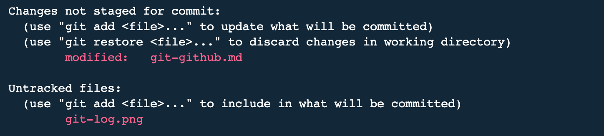

# Git and GitHub (Part 1) 
<br>             

<div align="center">
 
</div>

<br>

This article will provide an in-depth explanation of Git and its many useful commands, in an attempt to clarify much of the confusion on this subject matter. Admittedly, when I first started using Git and GitHub, I was perplexed, to say the least. After months of head scratching, trial, and absorbing knowledge from numerous resources, I finally understood the topic on a proficient level. However, for such a vital and widely used tool, there should be a more efficient way of teaching this material. Therefore, I am here to share some insight on what helped me to understand (and appreciate) Git on a functional level. 

<br>

### What is Git?
<br>

Before we dive into any subject matter, we first must ask ourselves two imperative questions - "What is it?" and "Why do I need to learn it?". 

Simply put, Git is a version control tool that manages file and code revisions. In other words, Git is a system that maintains a history of your code edits by tracking and storing changes you make to your code. Git has become the most commonly used and expected version control system in the industry. Therefore, it is just crucial to learn Git as it is to learn a programming language. Moreover, as a developer, it is imperative for you to be proficient with Git because Git provides:

- efficient project collaboration
- seamless code integration  
- centralized location to store your work
- isolated environment for code changes
- easy access to prior code content
- full local history stored on your machine
- error reversal
- file recovery
- ability to work offline
- and much more!

Now with that in mind, I want to clarify a few terminology that puzzled me early on, before we jump into the material.  

<br>

#### Is Git and GitHub the same?
<br>

Firstly, although the name may be misleading, Git is NOT short for GitHub. While Git is a version control tool, GitHub is an online platform that is used in conjunction with Git to store remote projects (also known as "repositories" or "repos"). There are other Git repository hosting services such as GitLab, BitBucket, CodeBase, etc; however, GitHub has become the largest community website for software development and the industry standard for hosting Git repositories, so that is the platform I will be discussing in this article. 

<br>

Secondly, many of Git's commands involves retreiving or releasing files between GitHub and your local machine. A "local" repository resides offline on a computer, whereas a "remote" repository resides online in GitHub. A repository may reside in either locations or both at any given time. One of Git's main functions includes synchronizing the two versions of your files (local and remote) which we will discuss in detail later on. 

<br>

### Getting Started
<br>

In order to begin, you need to:

- install [Git](https://git-scm.com/downloads),
- create a [GitHub](https://github.com/) account,
- open a code editor, and
- open a command line interface (often referred to as the command line or terminal) and be sure to understand the basic prompts.

<br>

### Setup and Configuration
<br>

After you have installed Git, provide a username and email (for Git to identify you as the author on future commands) by running the following commands:

```

$ git config --global user.name "Jane Doe"
$ git config --global user.email "jane_doe@company.com"

```

Security is of the utmost importance with Git and GitHub. Therefore, you need to generate an SSH key to authenticate and connect your local machine to GitHub. Fortunately, GitHub offers detailed documentation and assistance on [checking](https://docs.github.com/en/authentication/connecting-to-github-with-ssh/checking-for-existing-ssh-keys) for an existing key, [generating](https://docs.github.com/en/authentication/connecting-to-github-with-ssh/generating-a-new-ssh-key-and-adding-it-to-the-ssh-agent) a new key, and [adding](https://docs.github.com/en/authentication/connecting-to-github-with-ssh/adding-a-new-ssh-key-to-your-github-account) the new key to GitHub. 

<br>

Now that you have completed these steps, you are *finally* ready to use Git and GitHub...phew!

<br>

### Git Init
<br>
  
From your terminal (assuming you have a basic understanding of the command line), navigate to a folder that contains files you wish to conduct version control with and upload to GitHub. Please note that, for organization purposes, each of your projects should reside in a separate folder. After navigating to said folder, initialize your project by running ```git init``` which will alert Git to listen for file changes in this folder. This command will create a .git (hidden) directory that stores the metadata and files with your saved code changes. If you wish to change the root directory of your Git repository, simply move this .git directory to the desired folder. If you want to undo the initialization of your project entirely, simply remove this .git directory. Please note that, removing the .git directory is irreversible and will discards any changes that are not in a remote repository. 

<br>

## Git Status and Git Add
<br>

After initializing your project, you will notice that changes you make to a file in that directory will be prompt an alert from Git. At this phasse in the workflow, if you run ```git status```, you will see a list of modified files under "Untracked files: " in red text. An "untracked" file indicates that Git has not yet been informed of the specified file's existence. 

<br>



<br>

To utilize Git's version control system, you need to specifically instruct Git which files you want Git to track by using ```git add```. This command will send the specified file to the index (also referred to as the stage or staging area) which is a holding area for files that are ready to be saved or committed (I will discuss commits in the next section). The ```git add``` command may be used in the following manners:

- ```git add <filename>``` : adds specified file to index
- ```git add *.<extension>``` : adds all files with specified extension to index
- ``` git add .``` or ```git add -A``` : adds all files to index
- ```git add -u``` : adds only deleted and modifed files to index

<br>


<br>

Modified or new files in the staging area, are now considered "tracked" files and will appear in green text if you run ```git status``` once more. In other words, Git will only perform version control on staged/tracked files. Please note that, if you make changes to staged files, you will need to re-add them to the index; otherwise, Git will not be aware of the subsequent changes. If you modified files that have already been staged, and run ```git status```, those files will reappear in red text which indicates there are additional file changes that have not been staged. 


<br>

You can use ```git reset``` to remove files from the stage, if files were staged prematurely or inadvertently. The ```git reset``` command may be used in the following manner:

- ```git reset <filename>``` : removes specified files from the index
- ```git reset``` : removes all files from the index

<br>

## Git Commit and Git Log
<br>

In Git, a "commit" is essentially a snapshot of file changes and represents a version of the entire repository at a particular time. After a file has been committed, that particular version of the file is now saved and stored in your local repository (I will discuss how to upload changes to a remote repository in later sections). In keeping with Git's data integrity principles, each commit is accompanied with a 40-character unique identifier (also known as a "hashcode", "hash value", "checksum", or "label"). This hash value is generated by running your file's metadata and code through the SHA-1 algorithm. As a result, the hascode is directly linked with the file contents. In other words, if the file code changes, the hash value will also change; therefore, previous commits (and their associated messages) cannot be modified. It is best practice to (add and) commit files often in order to maintain a steady hisotry of your code changes and prevent losing significant code changes. The ```git commit``` command may be used in the following manner:

- ```git commit -m "<(required) descriptive message of changes>"``` : commits files from the index
- ```git commit -am "<(required) descriptive message of changes>"``` : adds and commits tracked files (combines ```git add``` and ```git commit```)
- ```git commit --amend -m "<(required) descriptive message of changes>"``` : modifies last commit message

<br>

If you wish to view a list of prior commits, the ```git log``` command will display a history of all commits made to the repository, in reverse chronological order. This log will include the 40-character commit id, author, datetime stamp, and the commit message previously included. You will notice the text, "HEAD" next to the latest commit. In Git, HEAD simply stands for the current, active, or working directory. Please note that, it is best practice for commit messages to be descriptive for easier version recognition. The ```git log``` may be used in the following manner:

- ```git log``` : lists history of all commits in repository with all associated data
- ```git log --online``` : lists history of all commits with just commit message and abbreviated hashcode 
- ```git log --graph``` : displays graphical depiction of all commits in repository
- ```git log --stat``` lists history of all commits with all associated data and abbreviated stats 

<br>


<br>

Just as ```git reset``` reverts ```git add``` commands, you can use ```git reset``` to undo commits in the following manner:

- ```git reset HEAD``` : reverses last commit
- ```git reset HEAD~1``` : reverses the commit prior to the last commit
- ```git reset <hashcode>``` : reverses file version to specified commit id
- ```git reset --hard <hashcode>``` : reverses multiple commits and resets current version (or HEAD) to specified commit

