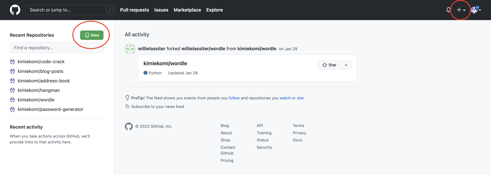
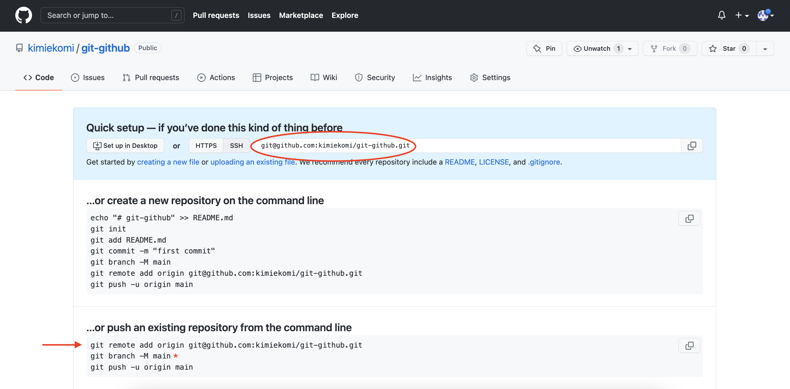
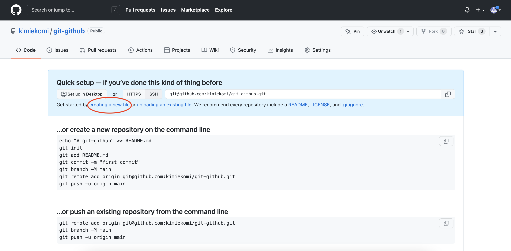
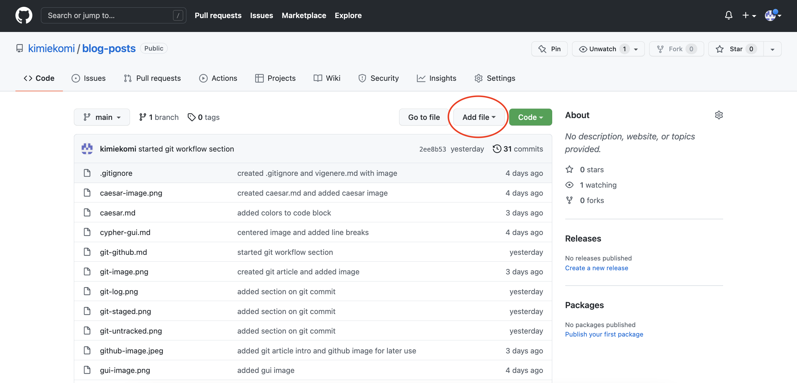
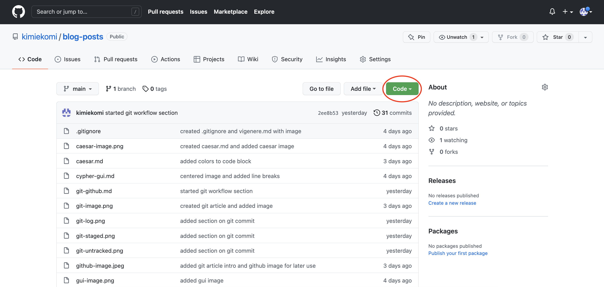

# Git and GitHub (Part 2) 
<br>             

<div align="center">
 
</div>

<br>

This article will provide further explanation of Git, GitHub, and their many useful (albeit often befuddling) operations. In my previous article on this subject matter, I briefly introduced GitHub - an online Git repository hosting service with the world's largest developer community. Much of the material I reviewed so far, merely pertained to local repositories. However, if you wish to collaborate with other programmers, share your work with the coding community, or store your repository online, then there are more advanced Git concepts and commands that you can employ.

So let's jump right in and pick things up where we left off!

<br>

### Git Push
<br>

Let's say, at the end of your workday, after you have commited your work to a local repository, you want to store your project on GitHub. At this point, you need to create a new empty repository on GitHub.com via the green "new" button on the upper left corner or the "+" button on the upper right corner of your GitHub homepage (as depicted in the image below by red circles).

<br>

 

<br>

Enter a name for your new repository, select the green "Create repository" button at the bottom of the page, then you will see your new repository's starter page. This page contains instructions on uploading your local project to GitHub. At the moment, all your work is only stored locally; therefore, you need to direct Git which remote repository you want your local project in. This step is accomplished with the ```git remote add origin <SSH URL>``` command (shown below with a red arrow). 

<br>

 

<br>

Afterwards, simply use the ```git push``` command to upload (also known as "push") your entire local repository to your newly created GitHub repository. Many developers choose to use the ```git push -u origin main``` command with the initial push. The ```-u``` flag is used to establish a tracking connection (or "upstream") between a local repository and the main "branch" (I will discuss branches in a later section). Establishing an upstream simply allows users to bypass typing "origin main" with each subsequent push. 

<br>

> Note: At the initial repositiory creation, one single branch is created which by default becomes the HEAD branch. If you created the repository locally, Git names this local branch "master". However, if you created the repository remotely, due to the negative connotations around the word "master", GitHub names this primary remote branch "main". That is why on the new repository starter page, GitHub includes instructions to rename the primary local branch (shown in the image above with a red asterisk). This is an optional step and can be done at any point in the workflow. If you wish to observe modern conventions and industry standards, use the ```git branch -m main``` command to rename the local HEAD branch. Throughout this tutorial, I will use the term "main" to referebce the primary branch.

<br>

And just like that, your local repository is now online, meaning you have a remote version of your latest commit. At this stage, if you navigate to your repository starter page, you will see that the instructions have been replaced with a list of your files.

Please note that, the repository starter page also provides instructions on creating a new remote repository from the command line. In other words, there is a *third* method to create a remote repository, aside from accessing GitHub.com. After commiting your code to a local repository, you can simply run ```git remote add origin <SSH URL>``` and push your project straight away, without visiting GitHub.com. However, instead of memorizing the SSH URL format, I choose to simply create a new remote repository through GitHub.com and copy/paste the URL from the starter page. 

<br>

### Git Pull and Git Clone
<br>

Now lets explore a different scenario. You have already learned how to create a file in your code editor and push to GitHub. However, your workflow may also progress in the inverse direction. Instead of starting out from your local environment, you can also create a new file from GitHub and "pull" the changes down to your local machine. To add a new file from GitHub, simply select "creating a new file" on the starter page or the "Add file" button if the starter page was replaced with your file list (shown below in red circles). By convention, the first file in a GitHub repository is typically a README.md which contains a summarized description of your project. After creating a new file on GitHub, it is only located in your remote repository. In order to synchronize the two versions, run ```git pull``` to download all file changes in all branches (there's that term again...I promise the branch section is coming up shortly) from the remote repository and integrate them with files in your local respository. 

<br>

 
 

<br>

The ```git pull``` command may be used in the following manner:

- ```git pull``` : pulls from all remote branches and updates all local branches (with previously established upstream between local and remote repositories)
- ```git pull origin main``` : pulls from remote main branch and updates local main branch (if upstream has not been established, then Git needs to know which remote branch to pull from)
- ```git pull <remote branch name> <local branch name>``` : pulls changes from a specific branch and updates specified local branch

<br>

Furthermore, if there is a repository on GitHub that is nonexistent on your local computer, you can pull an *entire* remote repository into your local environment by running the ```git clone <SSH URL>``` command. This command does not require you to create a project-specific folder in your code editor beforehand. Simply navigate to the desired directory, run ```git clone <SSH URL>```, and a folder by the same name as the specified remote repository will be created containting all the associated files. You can find the repository's SSH URL by navigating to the desired repository's homepage and clicking the green "Code" button (shown below with a red circle).

<br>

 

<br>

> Note: The ```git pull``` command actually combines two other git commands - ```git fetch``` and ```git merge```. If you wish to have more control over the integration process, you may want to run these two commands separately. Running ```git fetch``` on its own, will merely obtain or download the file changes from the remote repository; however, this command will not not conduct integration or make changes to local files. The ```git fetch``` command may be used in the following manner:
>- ```git fetch``` : downloads changes from all remote branches 
>- ```git fetch origin main``` : downloads changes from remote main branch (if upstream has not been established, then Git needs to know which remote branch to download from)
>- ```git fetch <remote branch name> <local branch name>``` : downloads changes from a specific branch
>
>There is more depth to the ```git merge``` command so I will discuss this topic in a section.

<br>

To take the concept of copying remote repositories one step further, ...fork

<br>

### Git Branch and Git Checkout (Git Switch)
<br>


<br>

### Git Diff, Git Merge, and Git Rebase
<br>


<br>