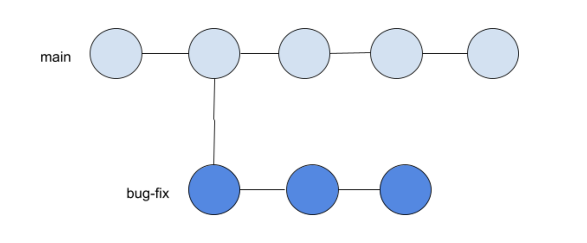

# Git and GitHub (Part 2) 
<br>             

<div align="center">
 
</div>

<br>

This article will provide further explanation of Git, GitHub, and their many useful (albeit often befuddling) operations. In my previous article on this subject matter, I briefly introduced GitHub - an online Git repository hosting service with the world's largest developer community. Much of the material I reviewed so far, merely pertained to local repositories. However, if you wish to collaborate with other programmers, share your work with the coding community, or store your repository online, then there are more advanced Git concepts and commands that you can employ.

So let's jump right in and pick things up where we left off!

<br>

### Git Push
<br>

Let's say, at the end of your workday, after you have commited your work to a local repository, you want to store your project on GitHub. At this point, you need to create a new empty repository on GitHub.com via the green "new" button on the upper left corner or the "+" button on the upper right corner of your GitHub homepage (as depicted in the image below by red circles).

<br>

 

<br>

Enter a name for your new repository, select the green "Create repository" button at the bottom of the page, then you will see your new repository's starter page. This page contains instructions on uploading your local project to GitHub. At the moment, all your work is only stored locally; therefore, you need to direct Git which remote repository you want your local project in. This step is accomplished with the ```git remote add origin <SSH URL>``` command (shown below with a red arrow). 

<br>

 

<br>

Afterwards, simply use the ```git push``` command to upload (also known as "push") your entire local repository to your newly created GitHub repository. Many developers choose to use the ```git push -u origin main``` command with the initial push. The ```-u``` flag is used to establish a tracking connection (or "upstream") between a local repository and the main "branch" (I will discuss branches in a later section). Establishing an upstream simply allows users to bypass typing "origin main" with each subsequent push. 

<br>

> Note: At the initial repositiory creation, one single branch is created which by default becomes the HEAD branch. If you created the repository locally, Git names this primary local branch "master". However, if you created the repository remotely, due to the negative connotations around the word "master", GitHub names this primary remote branch "main". That is why on the new repository starter page, GitHub includes instructions to rename the default local branch (shown in the image above with a red asterisk). This is an optional step and can be done at any point in the workflow. If you wish to observe modern conventions and industry standards, use the ```git branch -m main``` command to rename the local HEAD branch. Throughout this tutorial, I will use the term "main" to reference the primary branch.

<br>

And just like that, your local repository is now online, meaning you have a remote version of your latest commit. At this stage, if you navigate to your repository starter page, you will see that the instructions have been replaced with a list of your files.

<br>

### Git Pull and Git Clone
<br>

Now lets explore a different scenario. You have already learned how to create a file in your code editor and push to GitHub. However, your workflow may also progress in the inverse direction. Instead of starting out from your local environment, you can also create a new file from GitHub and "pull" the changes down to your local machine. To add a new file from GitHub, simply select "creating a new file" on the starter page or the "Add file" button if the starter page was replaced with your file list (shown below in red circles). By convention, the first file in a GitHub repository is typically a README.md which contains a summarized description of your project. After creating a new file on GitHub, it is only located in your remote repository. In order to synchronize the two versions, run ```git pull``` to download all file changes in all branches (there's that term again...I promise the branch section is coming up shortly) from the remote repository and integrate them with files in your local respository. 

<br>

 
 

<br>

The ```git pull``` command may be used in the following manner:

- ```git pull``` : pulls from all remote branches and updates all local branches (with previously established upstream between local and remote repositories)
- ```git pull origin main``` : pulls from remote main branch and updates local main branch (if upstream has not been established, then Git needs to know which remote branch to pull from)
- ```git pull <remote branch name> <local branch name>``` : pulls changes from a specific branch and updates specified local branch

<br>

Furthermore, if there is a repository on GitHub that is nonexistent on your local computer, you can pull an *entire* remote repository into your local environment by running the ```git clone <SSH URL>``` command. This command does not require you to create a project-specific folder in your code editor beforehand. Simply navigate to the desired directory, run ```git clone <SSH URL>```, and a folder by the same name as the specified remote repository will be created containting all the associated files. You can find the repository's SSH URL by navigating to the desired repository's homepage and clicking the green "Code" button (shown below with a red circle).

<br>

 

<br>

> Note: The ```git pull``` command actually combines two other git commands - ```git fetch``` and ```git merge```. If you wish to have more control over the integration process, you may want to run these two commands separately. Running ```git fetch``` on its own, will merely obtain or download the file changes from the remote repository; however, this command will not not conduct integration or make changes to local files. The ```git fetch``` command may be used in the following manner:
>- ```git fetch``` : downloads changes from all remote branches 
>- ```git fetch origin main``` : downloads changes from remote main branch (if upstream has not been established, then Git needs to know which remote branch to download from)
>- ```git fetch <remote branch name> <local branch name>``` : downloads changes from a specific branch
>
>There is more depth to the ```git merge``` command so I will discuss this topic in a section.

<br>

Another method to copy remote repositories, is through GitHub's "fork" procedure. This practice is used to copy another developer's entire repository onto your own GitHub account which will provide you complete access or control to make changes to the repository. On the desired repository's homepage, simply click the gray "Fork" button on the upper right corner of the window (shown below by the red circle). And just like that, you now have an entire remote copy of the repository available under your account name.  

<br>

 

<br>

### Git Branch and Git Checkout (Git Switch)
<br>

Similar to how commits are snapshots of a particular code revision, branches also represent a separate version of the code and is applied to the entire repository. However, the key difference is that branches contain a *series* of commits that lead to the current state, whereas a commit is merely the *latest* revision of the codebase. Alternatively, a branch is a pointer to a particular commit or location where a subsequent commit sequence may begin. At the initial creation of a branch, it is merely an exact replica of the main branch. However, as the new branch acquires its own commit history, the new branch starts to form a life of its own, separate from the main branch. Branching allows developers in collaboration to work on various aspects of the code in parallel without disrupting one another's work. With the creation of branches, a repository can be seen as a tree of commits (or versions), with parellel branches (or tracks) diverging from various commits (or renditions of the project). Capiche?

Branches can only be created locally, then uploaded to a remote repository. To create a new branch, use the ```git branch``` command in the following manner:

- ```git branch``` : lists all branches and indicates HEAD branch with green text and asterisk 
- ```git branch <new branch name>``` : creates new local branch with specified name, off latest commit
- ```git branch <new branch name> <hashcode>``` : creates new local branch with specified name, based on specified revision of code
- ```git branch -m <new branch name>``` : renames HEAD branch 
- ```git branch -m <branch name> <new branch name>``` : renames non-HEAD branch 

<br>

>Note: Branch names may not be duplicated. Using ```-M``` (with a capital "M") forces a name change despite branch name conflicts, and the local branch being renamed will override the existing local branch. This may result in the unintended removal of the existing local branch. There is no Git command to rename a remote branch. To do so, delete the remote branch in question, and upload a new branch with the desired branch name. When deleting a remote branch, it is best practice to also delete its counterpart local branch to avoid clutter and confusion. 

<br>

 

<br>

- ```git branch -d <branch name>``` : deletes specified local branch (must be on different branch than the one removing)
- ```git push origin --delete <branch name>``` : deletes specified remote branch
- ```git branch --track <branch name>``` : downloads specified remote branch onto local machine and instructs HEAD branch to track and alert of any changes in specifed branch 
- ```git branch --track <new local branch name> <existing remote branch name>``` : creates new branch in local machine based on specified remote branch (which does not currently reside in local machine) and sets tracking connection between the two 

<br>

There are two methods to navigate from one branch to another - ```git switch <branch name>``` and ```git checkout <branch name>```. The ```git switch``` command is palpable and accomplishes one task only - changing the HEAD branch to the specified branch. However, the ```git checkout``` command is more complicated and can also be used in the following manner:

- ```git checkout -b <new branch name>``` : creates new branch and navigate to the new branch
- ```git checkout --track <branch name>``` : downloads specified remote branch onto local machine and instructs HEAD branch to track and alert of any changes in specifed branch (accomplishes same tasks as ```git branch --track <branch name>```)
- ```git checkout <hashcode>``` : navigates to specified commit

<br>

Please note that, using the ```git checkout <hashcode>``` command will leave you in a "detached HEAD" state. In part 1 of my Git article, I fundamentally defined HEAD as the current, active, or working directory in Git. To expand on that rudimentary definition, not only does HEAD point to the current branch, it also *always* points specifically to the *latest commit* in the active branch. The ```git checkout <branch name> command automatically moves the HEAD pointer to the newest commit on the specified branch. However, the ```git checkout <hashcode>```, command moves the HEAD pointer to a previous commit (without designating the specified commit as the new HEAD), thereby "detaching" the head from the tip of the active branch. This command will only allow users to *view* a prior revision and will not revert the file to a prior state. Commits are disabled in a detached head state, making it treacherous territory to be in. Code revisions made in a detached head state cannot be saved, as they do not belong to any branches; when you eventually switch to a different branch, these changes will be lost. To exit the detached head state, you have two choices: 

1. checkout or navigate back to the previous branch 
2. create and navigate to a new local branch from this point

<br>

 
 

<br>

This is not to be confused with ```git reset <hashcode>``` which effectively labels a prior commit as the new HEAD, *removes/reverses* any revisions after the specified commit, and moves the end of the branch to the specified point; thereby, maintaining an "attached" HEAD state. 

<br>

 
 

<br>

### Git Diff, Git Merge, and Git Rebase
<br>

Typically, projects have a main branch which only contains production ready code. All other branches are for development or code in progress. Once work on a branch is complete, they will be integrated with the main branch.  

<br>