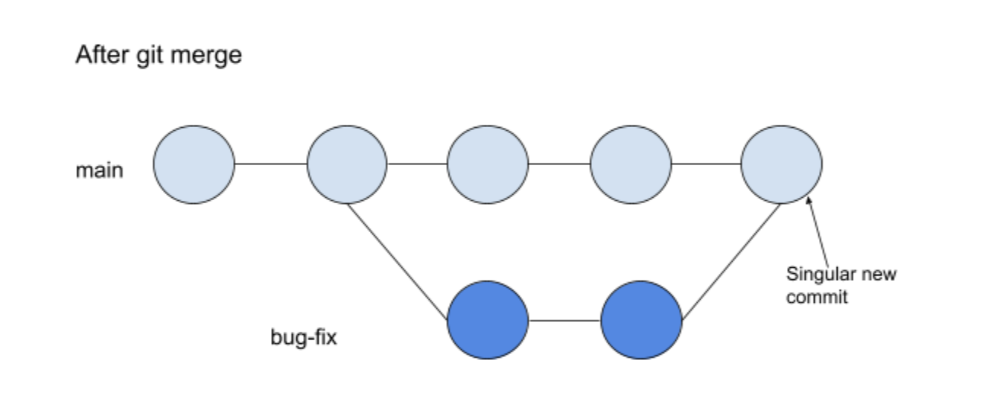
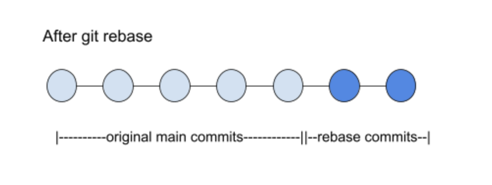

# Git and GitHub (Part 3) 
<br>             

<div align="center">
 
</div>

<br>

This article will provide a detailed explanation of advanced Git and GitHub operations. In my previous Git and GitHub articles, I discussed the GitHub workflow and introduced - one of the most important Git features and concepts that aid in project collaboration - branching. The ability to create and navigate between branches allows developers to work independently and isolate their program endeavors from the main codebase. To provide individual testing of project features, branching works best when each branch represents a singular characteristic or entity of the main project. When development branches are completed, they are integrated back to the main branch. This stage of the workflow is where we left off in the last article on this topic. 

So without further adieu, let's immerse into the world of Git and GitHub!

<br>

### Git Merge and Git Rebase
<br>

To incorporate two different local branches, use the ```git merge <branch name>``` command. Please note that, you must switch to the "receiving" branch then provide the "giving" branch's name (the branch with the code modifications) when running ```git merge <branch name>```. You may also combine the two commands into one command by running ```git merge <giving branch name> <receiving branch name>``` without having to checkout a branch beforehand. Both the above commands will generate a new merge-commit in the development branch and Git will then seamlessly integrate the changes from one branch into the other. 

<br>

Another method to consolidate two local branches, is through the ```git rebase <branch name>``` command (in this case, navigate to the *giving* branch then specify the *receiving* branch's name). This command will also integrate changes from one branch into the HEAD branch. However, instead of converging with the main local branch at the HEAD, ```git rebase <branch name>``` will simply take all the commits in the development branch and append them to the HEAD. This method is less popular because it creates new commits for each prior revision in the main branch, thereby rewriting history in a sense. The main benefit to rebasing, is a cleaner or simpler project history. In other words, after rebasing, the git log will depict commits as one linear line, as if branching and reintegration did not occur. 

<br>

 
 

<br>

merge conflict 123

<br>

### GitHub Pull Request
<br>

Merging and rebasing both occur on the local level, and as usual, changes can be pushed to a remote repository to synchronize the two versions. However, after a development branch is completed and pushed to a remote repository, branch incorporation may also materialize on the remote level. Projects typically have one lead or senior developer who maintains full control over the entire repository. Thus, if you do not own the respository, you cannot integrate a development branch into the main branch without explicit permission. In GitHub, this is achieved by generating a "pull request" which allows collaborating developers to review (and provide feedback on) your code changes before incorporating them into the main branch. You may conduct a pull request by following the steps below.

1) Select "pull request" on the repository's navigation bar  
2) Click on the green "New pull request" button
3) Select two branches to compares
4) Click on the gree "Create pull request" button

If you are the project lead, at this point, you will see a list of pull requests on the repository's pull request page. Simply select the particular pull request you wish to review, then at the bottom of the page, you can click on the green drop-down menu button to select whether you want to perform a merge or a rebase. Then further down the page, click on the green "Confirm" button, and you will have successfuly integrated the two branches.  

<br>