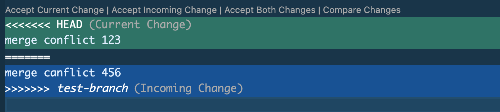

# Git and GitHub (Part 3) 
<br>             

<div align="center">
 
</div>

<br>

This article will provide a detailed explanation of advanced Git and GitHub operations. In my previous Git and GitHub articles, I discussed the GitHub workflow and introduced - one of the most important Git features and concepts that aid in project collaboration - branching. The ability to create and navigate between branches allows developers to work independently and isolate their program endeavors from the main codebase. To provide individual or isolated testing of project features, branching works best when each branch represents a singular characteristic or entity of the main project. When development branches are completed, they are integrated back to the main branch. This stage of the workflow is where we left off in the last article on this topic. 

So without further adieu, let's immerse into the world of Git and GitHub!

<br>

### Git Merge and Git Rebase
<br>

To incorporate two different local branches, use the ```git merge <branch name>``` command. Please note that, you must switch to the "receiving" branch then provide the "giving" branch's name (the branch with the code modifications) when running ```git merge <branch name>```. You may also combine the two commands into one command by running ```git merge <giving branch name> <receiving branch name>``` without having to checkout a branch beforehand. Both the above commands will generate a new merge-commit in the development branch and Git will then seamlessly integrate the changes from one branch into the other. 

<br>

Another method to consolidate two local branches, is through the ```git rebase <branch name>``` command (in this case, navigate to the *giving* branch then specify the *receiving* branch's name). This command will also integrate changes from one branch into the HEAD branch. However, instead of converging with the main local branch at the HEAD, ```git rebase <branch name>``` will simply take all the commits in the development branch and append them to the HEAD. This method is less popular because it creates new commits for each prior revision in the main branch, thereby rewriting history in a sense. The main benefit to rebasing, is a cleaner or simpler project history. In other words, after rebasing, the git log will depict commits as one linear line, as if branching and reintegration did not occur. 

<br>

 
 

<br>

Some developers may choose to be more involved with the rebase process by rebasing in interactive mode. Interactive rebase provides users more control over a branch's commit hisotry by performing dedicated actions on individual commits. To enter interactive mode, run the ```git rebase -i <branch name>``` command (with the receiving branch's name). Git will then open a text editor with a list of all the commits that will be moved to the receiving branch. At this point, you have several commit altering options, including:

- ```p <commit>``` : (pick) use commit 
- ```r <commit>``` : (reword) use commit change commit message
- ```e <commit>``` : (edit) use commit and modify contents of commit
- ```d <commit>``` : (drop) remove commit
- ```s <commit>``` : (squash) use commit and combine with previous commit 
- ```f <commit>``` : (fixup) same as squash but removes second commit message

<br>

Entered the desired options and Git will perform the rebase based on your instructions. Keep in mind that, ```git rebase``` generates new commits; therefore, always rebase a development branch onto a main branch. If you conducted the opposite and rebased main onto a development branch, this will cause a disruption in all other collaborating developer's repositories. 

<br>

### Merge Conflicts
<br>

Git is able to easily and efficiently handle branch integration when there are no disparities between branches. However, attempting to merge files that contain code discrepancies will result in a "merge conflict" which occurs when Git is unable to automatically resolve and merge code differences. Merge conflicts arise when two branches have competing changes to the same line of code or when a file has been deleted from one branch but not the other. These circumstances require developers to resolve the conflict (and commit the changes) before Git can proceed with the merge.   

<br>

 

<br>

In the event of a merge conflict, the ```git status``` command will disclose which file contains the discrepancy. Furthermore, when you open the specified file in a code editor, Git will indicate the exact line(s) with the code disparity within a series of arrows. To resolve the conflict, modify the specified line(s), remove the lines with the associated arrows, then stage and commit the new changes to finalize the merge process. 

<br>

 

<br>

### Git Diff
<br>

When workingw with multiple branche, another useful command to incorporate into your workflow is the ```git diff``` command which is used to view variations between files, branches, or even commits. Some developers use this command before running ```git merge``` in order to foresee and prevent a merge conflict scenario, as ```git diff``` simply compares the HEAD with the index. In other words, ```git diff``` compares two version and reflects the differences between content in the working directory and the stage. The ```git diff``` command may be used in the following manner:

- ```git diff``` : compares uncommitted changes across entire repository since the last commit
- ```git diff <file path>``` : compares changes made to specified files
- ```git diff <older hashcode> <newer hashcode>``` : compares changes between two commits 
- ```git diff <branch name> <other branch name>``` : compares changes between two branches
- ```git diff <branch name> <other branch name> <filename>``` : compares changes in specified file between two branches

<br>

### GitHub Pull Request
<br>

Merging and rebasing both occur on the local level, and as usual, changes can be pushed to a remote repository to synchronize the two versions. However, after a development branch is completed and pushed to a remote repository, branch incorporation may also materialize on the remote level. Projects typically have one lead or senior developer who maintains full control over the entire repository. Thus, if you do not own the respository, you cannot integrate a development branch into the main branch without explicit permission. In GitHub, this is achieved by generating a "pull request" which allows collaborating developers to review (and provide feedback on) your code changes before incorporating them into the main branch. You may conduct a pull request by following the steps below.

1) Select "pull request" on the repository's navigation bar  
2) Click on the green "New pull request" button
3) Select two branches to compares
4) Click on the gree "Create pull request" button

If you are the project lead, at this point, you will see a list of pull requests on the repository's pull request page. Simply select the particular pull request you wish to review, then at the bottom of the page, you can click on the green drop-down menu button to select whether you want to perform a merge or a rebase. Then further down the page, click on the green "Confirm" button, and you will have successfuly integrated the two branches. For more information on this process, [GitHub](https://docs.github.com/en/pull-requests/collaborating-with-pull-requests/proposing-changes-to-your-work-with-pull-requests/about-pull-requests) provides detailed descriptions of their pull-request processes. 

<br>

### Git Stash
<br>

One last operation that you may find useful is the ```git stash``` command which temporarily stores *tracked* staged or unstaged changes in a separate location and reverts the working directory to the last commit. This process allows developers to pause their work, reserve file modification that aren't ready to be staged or committed, and proceed work on a different section of the codebase. To employ previously stashed changes, run the ```git stash pop``` command to reapply code changes to the working directory and remove them from the stash. Similarly, the ```git stash reapply``` command restores code modifications but retains them in the stash to allow access from multiple branches. Please note that, Git will not stash untracked or ignored files. To override this restriction and allow Git to stash untracked files, use the ```git stash -u``` or ```git stash --include-untracked``` command. If you wish to store multiple stashes, it is best practice to add a message to each stash by using the ```git stash save "<descriptive message>"```command to provide quick identification. The ```git stash list``` will display an ordered list of stashed changes, with the most recent stash at the top of the list. To select a particular stash to reapply, simply run ```git stash pop stash@{<number>}``` to select the desired stash. 

<br>

### Conclusion
<br>

Many developers consider Git a difficult subject to comprehend; however, it is agreed upon that Git is a vital tool for any developer, regardless of their expertise level or job title.  